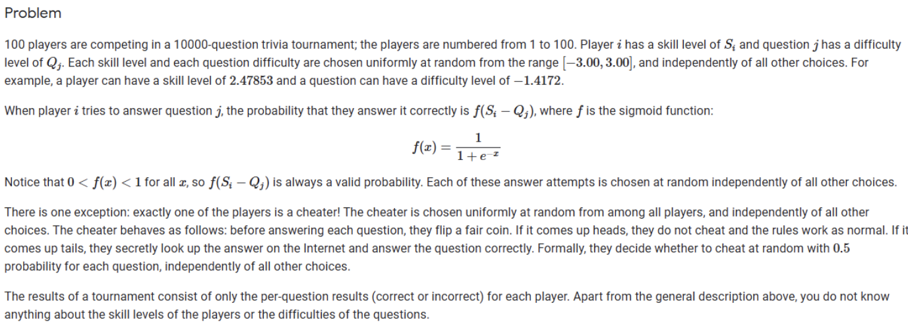
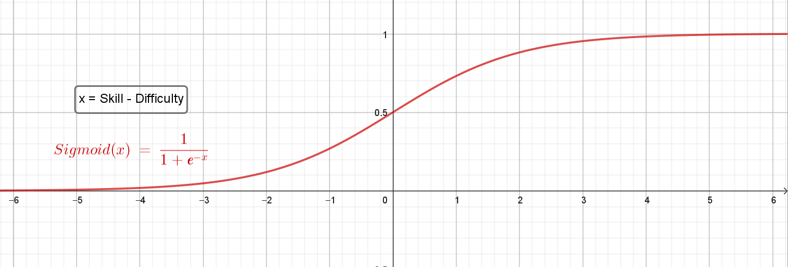
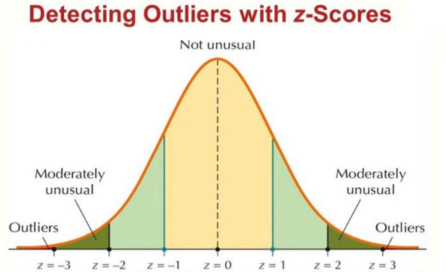
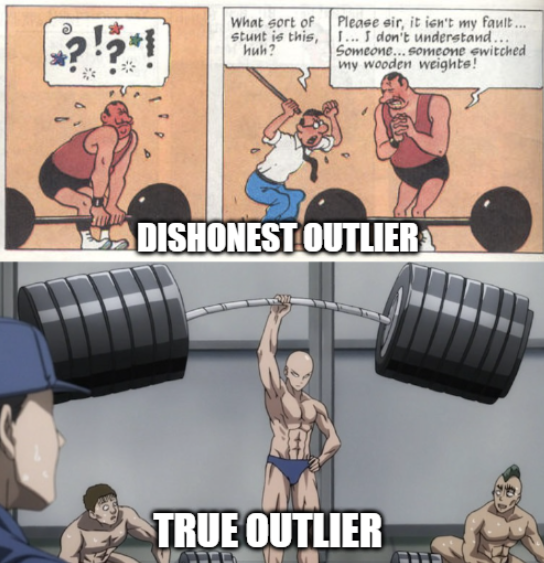
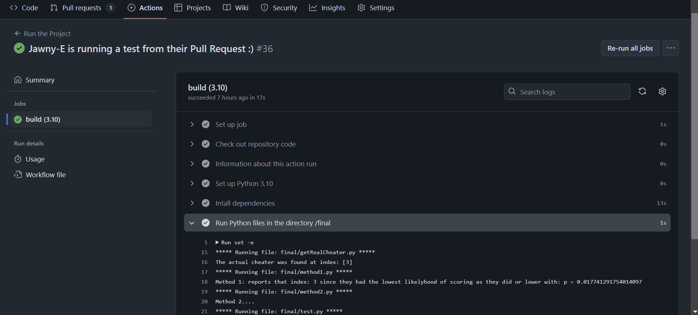
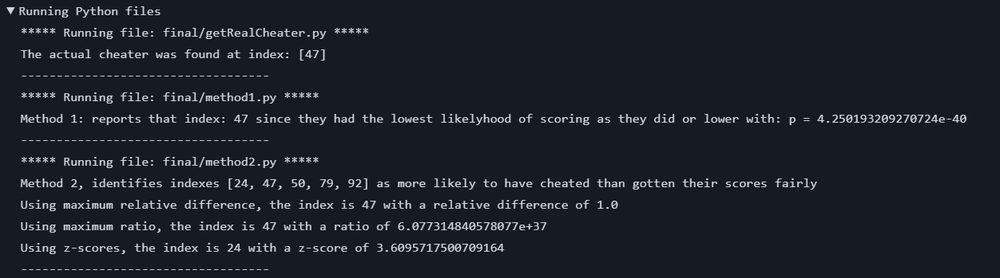
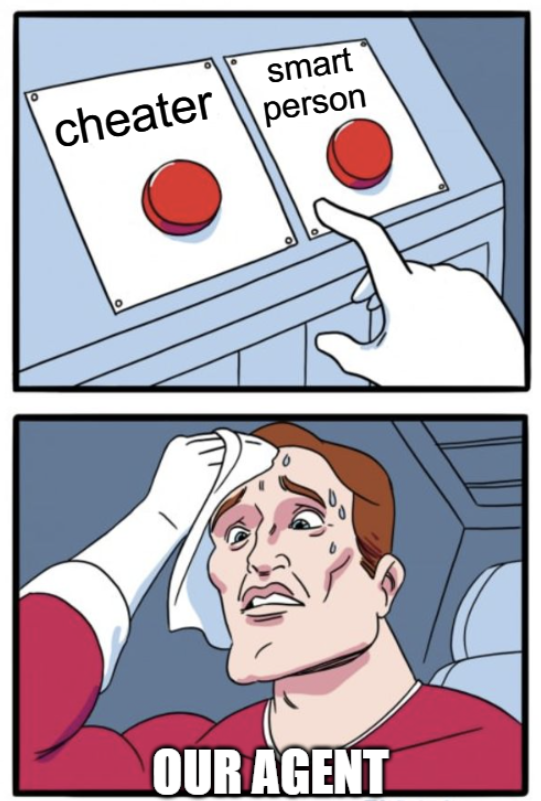
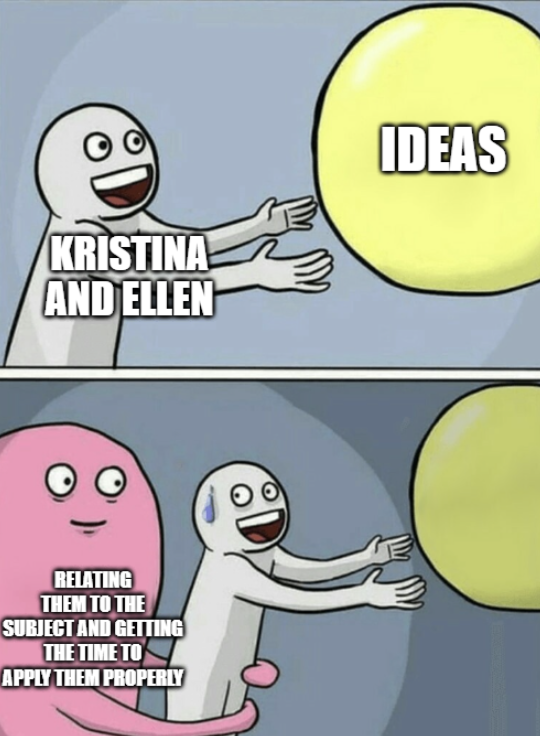

<!-- TOC start (generated with https://github.com/derlin/bitdowntoc) -->

- [Catching cheaters using an methods from ADA511](#catching-cheaters-using-an-methods-from-ada511)
   * [Some cool Background info](#some-cool-background-info)
      + [The Sigmoid Function](#the-sigmoid-function)
      + [Z-scores](#z-scores)
   * [Project description](#project-description)
      + [Datasets](#datasets)
         - [Exam-results by player](#exam-results-by-player)
         - [Results by question](#results-by-question)
      + [Solutions](#solutions)
         - [Method 0: Just test scores](#method-0-just-test-scores)
         - [Method 1: Test scores and skill-levels](#method-1-test-scores-and-skill-levels)
         - [Method 2: Being allknowing, trying to identify probable cheaters and outlier detection](#method-2-being-allknowing-trying-to-identify-probable-cheaters-and-outlier-detection)
         - [Method 3: Not knowing the skill, and not necessarily knowing the difficulty](#method-3-kristina-you-got-this-)
   * [How to install and setup the project](#how-to-install-and-setup-the-project)
      + [Results](#results)
      + [Further development](#further-development)

<!-- TOC end -->

<!-- TOC -->
# Catching cheaters using an methods from ADA511
The problem of cheating has long plauged higher-education. Under immense pressure to meet high expectations some will, sacrifice their integrity for the hope of a higher grade. Institutions have to fight an uphill-battle to try to keep pace with the arms-race of ever-evoloving cheating methods. The emphasis cannot only be on prevention, but also on swift decisive action against those who chose dishonesty.

*Scenario: You are a university lecturer and you have been informed by the examination montiors that they caught a glimpse of one student in your class  using their phone during the end-of-year exam. The monitor could not identify the The university is pressuring you to identify the wronging party. You have all the exam answers, but is that enough? Can you employ techiques from ADA511 to assign probabilities of being the cheater to the different students?*

This project is inspired by a Code-Jam Qualification round in 2021, which gives the following additional information about the scenario:

This material is not available online anymore, we had to employ the waybackmachine to get the problem description. We have further made adjustments to make the amount of students, the amount of questions and the probability of cheating on any given question variables so that it's simple to retest for your presumed scenario. 

The scenario itself gives us the following information of probability:
$P(success|non-cheater, Z)=f(S_i-Q_i)$
$P(success|cheater, Z)=0.5\cdot 1 + 0.5f(S_i-Q_i)$
$P(cheater)= \frac{1}{students} = 1-P(non-cheater)$
$P(Q_i=q|Z)=\frac{1}{(6\cdot 10^{accuracy})+1}$ e.g. if you use 0 decimal places, it would be $P(Q_i=q|Z)=\frac{1}{6+1}$
$P(S_i=s|Z)=\frac{1}{(6\cdot 10^{accuracy})+1}$ e.g. if you use 2 decimal places, it would be $P(Q_i=q|Z)=\frac{1}{600+1}$

<!-- TOC -->
## Some cool Background info
Some related subjects we looked into during the subject, that are interesting reading for the problem at hand
<!-- TOC -->
### The Sigmoid Function
The Sigmoid function is a logistic function written as follows: $ \sigma(x) = \frac{1}{1+e^{-x}} $. It forms an monotonically increasing S-shaped curve with range [0,1] and domain [-$\infty$,$\infty$]. It is often used as an activation function in neural networks. The function is also used frequently to model probabilities of binary outcomes in logistic regression. We then in our case assume the modelling has already been completed (by the lovely people hosting Code Jam, or maybe yourself), and we have found the relationship between the probabilty of getting something correct and the values for player Skill[-3,3] and question Difficulty[-3,3]

Possible limitiations in our project: over-simplifying of the real-world events and assumption of independece of questions from one another. 

<!-- TOC -->
### Z-scores
Also called the standard score, is the number of standard deviations a data-point is away from the mean value of something being measured. It is calculated using the formula $Z=\frac{x-\mu}{\sigma}$, where $x$ is the datapoint, $\mu$ is the mean of the sample, and $\sigma$ is the standard deviation of the sample. Traditionally, for a normal distribution, an outlier is defined as a datapoint that has a z-score greater than 3, in either positive or negative direction. Only 0.03% of people are found in this range. For this project we are more interested in the positive outliers than the negative ones. 

<!-- TOC -->
## Project description
In short the goal of this project is to identetify outliers, who are not "natural" outliers in the population. This work will mostly be done through assumptions of behaviour, and 

and attempt to determine if they're truly a natural outlier, or if they've used other means to acheive their results. 

<!-- TOC -->
### Datasets
The project includes a Python script that can create datasets for you. The number of students and questions are set as global variables, as well as the probabiltiy for the cheater successfully checking their phone.
Here are some small examples of our datasets:

<!-- TOC -->
#### Exam-results by player
|Index|Truthfulness|Skill|S0 |S1 |S2 |S3 |S4 |S5 |S6 |S7 |S8 |S9 |
|-----|------|-----|---|---|---|---|---|---|---|---|---|---|
|0    |t     |-1.6 |1  |1  |0  |0  |0  |0  |0  |0  |0  |0  |
|1    |t     |-0.1 |0  |1  |0  |0  |0  |1  |1  |1  |1  |1  |
|2    |t     |1.9  |1  |1  |1  |0  |1  |1  |1  |1  |0  |1  |
|3    |c     |0.7  |1  |1  |1  |1  |1  |1  |1  |1  |1  |1  |
|4    |t     |0.5  |1  |1  |1  |0  |0  |1  |1  |1  |1  |1  |
|5    |t     |0.4  |1  |1  |0  |1  |0  |1  |1  |1  |1  |1  |
|6    |t     |0.5  |1  |1  |1  |0  |0  |1  |1  |1  |1  |1  |
|7    |t     |0.4  |1  |0  |0  |0  |1  |1  |1  |1  |1  |1  |
|8    |t     |-0.2 |1  |1  |0  |1  |0  |1  |1  |0  |0  |1  |
|9    |t     |0.1  |0  |1  |0  |0  |0  |1  |1  |1  |1  |1  |

<!-- TOC -->
#### Results by question
|Index|Diffuculty|S0  |S1 |S2 |S3 |S4 |S5 |S6 |S7 |S8 |S9 |
|-----|----------|----|---|---|---|---|---|---|---|---|---|
|0    |0.9       |1   |0  |1  |1  |1  |1  |1  |1  |1  |0  |
|1    |-1.9      |1   |1  |1  |1  |1  |1  |1  |0  |1  |1  |
|2    |0.3       |0   |0  |1  |1  |1  |0  |1  |0  |0  |0  |
|3    |1.5       |0   |0  |0  |1  |0  |1  |0  |0  |1  |0  |
|4    |1.1       |0   |0  |1  |1  |0  |0  |0  |1  |0  |0  |
|5    |-1.7      |0   |1  |1  |1  |1  |1  |1  |1  |1  |1  |
|6    |-0.8      |0   |1  |1  |1  |1  |1  |1  |1  |1  |1  |
|7    |-2.0      |0   |1  |1  |1  |1  |1  |1  |1  |0  |1  |
|8    |-1.4      |0   |1  |0  |1  |1  |1  |1  |1  |0  |1  |
|9    |-1.7      |0   |1  |1  |1  |1  |1  |1  |1  |1  |1  |

Here we can see that we have the following variates in the datasets are as follows:
| **Variate**         	| **Shorthand** 	| **Quantity** 	| **Domain** 	| **Description**                                        	|
|---------------------	|---------------	|--------------	|------------	|--------------------------------------------------------	|
| Intelligence(Skill) 	| I             	| Interval     	| [-3, 3]    	| Binomially spaced interval                             	|
| Difficulty          	| D             	| Interval     	| [-3, 3]    	| Uniform interval                                       	|
| Success_n           	| S_n           	| Binary       	| [0, 1]     	| Binary value, 0 denotes a failure, 1 denotes a success 	|
| Truthfulness        	| T             	| Binary       	| [t, c]     	| Binray value, 't' indicates truthful, 'c' indicates    	|

<!-- TOC -->
### Solutions

<!-- TOC -->
#### Method 0: Just test scores
If you do not know the Intelligence of the student, Truthfulness or the Difficulty of the question. All you have to base your assumption on is the set of Successes. It is here virtually impossible to differentiate between a true outlier or a cheater. You could use the following definitions to try to determine the cheater, but you would quickly find that you will end up accusing the best-scorer every single exam. 
- $P(S_1=success | S_2=success, Z) = P(S_1= success| Z)$
- $P(T=cheater) = 1 - (totalscore=score ∨ totalscore=score+1 ∨ totalscore=score+2 ∨ ... |Z)$

<!-- TOC -->
#### Method 1: Test scores and skill-levels
The second possible way of looking at this problem is to assume that every answer is independent of each other, and that the student has equal probabilty of answering correctly on every single question, given a previously established intelligence(skill) score. We can then learn about a quantity from similar quantities. To find the probaility of Success appearing equally or more times than the student achived. We then identify the dishonest outlier as the person with the lowest probability of scoring as they did or lower
We can then use the following relations:
- $P(S_1=success | S_2=success, Z) = P(S_1= success, Z)$
- $P(T=cheater|I=i, Z) = 1 - P(totalscore=score ∨ totalscore=score+1 ∨ totalscore=score+2 ∨ ...| I=i, Z)$
- $P(totalscore=s|I=i, Z) = \binom{n}{k}\cdot p^{k}\cdot (1-p)^{n-k}$, where $n$ is the number of questions, $k$ is the number of successes and $p$ is the probability of a success. $p$ assumed to be the result of the sigmoid function dependent only on intelligence
 
<!-- TOC -->
#### Method 2: Being allknowing, trying to identify probable cheaters and outlier detection
If you were allknowing and perfectly knew the difficulties and student skills on this *cough* anonymous exam *cough* you could try the following. 
Calculate
- $P(S_1=result\wedge S_2=result\wedge S_3=result\wedge S_4=result \wedge ... \wedge S_i=s|T=cheater,Z)$
- $P(S_1=result\wedge S_2=result\wedge S_3=result\wedge S_4=result \wedge ... \wedge S_i=s|T=non-cheater,Z)$

for all the different students and different difficulties. Then you could compare the likelyhood of a student getting their result fairly with the likelyhood of them getting it unfairly. 
Store all the indexes where a student has a higher $P(result|cheater,Z)$ than $P(result|non-cheater,Z)

Further you could apply outlier detection methods to try to figure out whom in this list is the most likely untrusthworthy outlier. 
We apply the following methods to try to find the outlier among probable cheaters

1. Relative Difference: Looks at the difference between the likelyhood of cheating and the likelyhood of not cheating for the given student. Divided by the likelyhood of cheating. For a student that is much much more likely to have cheated this should go towards 1, and for a student that barely was more likely to cheat than to have gotten their answers truthfully it should be closer to 0
2. Ratio-analysis: Looking at the ratio between cheating likelyhood and normal likelyhood. Similarly to the previous metric, this highlights cases where the likelihood of cheating is overwhelmingly higher than the likelihood of normal performance.
3. Z-scores: The Z-score measures how many standard deviations a value (cheating likelihood) is from the mean of the normal likelihoods. We try to apply this to find the most extreme outlier from the baseline group of students. This unlike the others will give us the most extreme outlier only, which often can point us to a smart student instead of our cheater. 

<!-- TOC -->
#### Method 3: Not knowing the skills of the students, and both knowing the difficulties, and using estimated difficulties based on number of successfull answers
First the method calculated the probability for a result of a student, for each skill in the range [-3,3], given a difficulty for each question. It calculates for both cheating and being truthfull, for each skill. It then summarized the probabilites for all skills, both for cheating and truthfullness and finds the ratio between the ones that have a greater probability for being a cheater. It finds the student with the highest ratio.
It checks against both the actual difficulties, but also estimated diffiiculties based on how many has answered a question correct. Naturally, estimating the difficulties of the questions works poorly if few students have taken the test.
With enough questions and students this method can identify the cheater when just given the results, not knowing skills or difficulties.

<!-- TOC -->
## How to install and setup the project
This project has inbuilt GitHub actions, where all methods in the final directory are ran and tested. It is set up to run both when an update is made to a Pull Request and manually from dispatch, you can edit this to fit your workflow better. Fork this repository to quickly take advantage of these methods. 

Otherwise the files should be simple enough to download and run by yourself, all Python libraries used are listed in the file requirements.txt.

<!-- TOC -->
### Results

None of the methods in the project can boast perfect identification of the cheater, and some methods assume information that might be impossible to estimate in a real-life situation. The methods applied here might better be called an exploration of the scenario using ADA511, than a defintive solution. We see from our methods that it is very difficult to differentiate between a true outlier, a very lucky person and someone who cheated on the exam. However, it must be mentioned that our technniques that try to identify all potential cheaters, are including the registered cheater in their list. So you could potentially have a very stern talk with all of them to try to figure it out.

<!-- TOC -->
### Further development
Since this task became more complex than expected, we didn't get to implement everything we originally wanted, so here is a list of all our *totally cool and awesome* ideas for future development.
- Machine learning: a potential alternative method for solving the problem in the scenario could be through training a neural network to try to predict the Truthfulness of a student
- Returning answers P(T=cheater|Z) as a probability distribution over all the different students, honestly just returning P(T=cheater|Z) with security would be a great step for further exploration
- Trying to adapt the Optimal Predictor Machine to fit the 
- Trying to limit the dataset for the agent, in the scenario this could be that one lecturer only gets 60% of the answers since the subject has multiple spearate parts (like Cyber Physical Systems)
- Utilities: we would love to apply utilities and decision trees to the solution. There might be gains or losses for the agent if they accuse the right or wrong student of cheating. 
- Frontend: Although we are happy with the GitHub Actions implementation, Ellen wants to get the actions to update a GitHub page that more clearly displays the results. This would also make it more accessible to users without knowledge of GitHub. Kristina wants a more interactive frontend (maybe a game as well!) where users can edit the premises of calcultation quickly.

